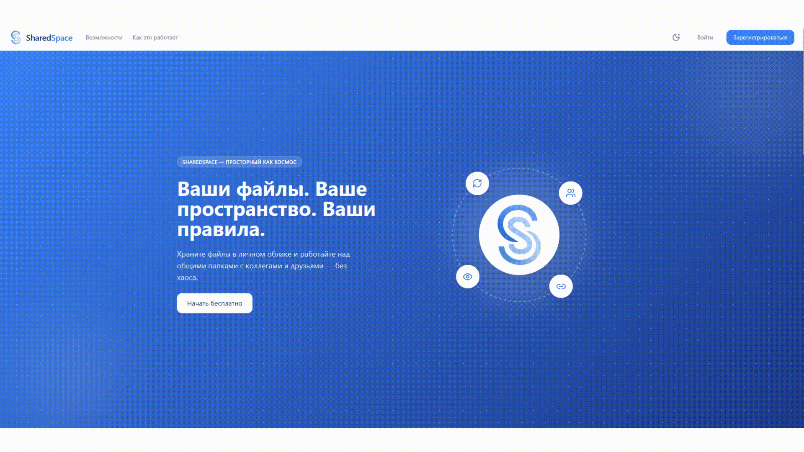

# SharedSpace

Файловый хостинг с совместным доступом.
Загружайте файлы, делитесь ссылками и работайте в общих папках с командой.

---



*Запись сделана с помощью SharedSpace*

---

## Быстрый старт

```bash
git clone https://github.com/TAskMAster339/SharedSpace.git
cd SharedSpace
cp .env.example .env
docker compose up --build
```

После запуска:
- **Фронтенд** → http://localhost
- **API** → http://localhost:8080
- **Swagger** → http://localhost:8080/swagger/

## Разработка

Подробная документация — в папке [`/docs`](/docs).

**Бэкенд:** `cd backend && go run ./cmd/api`
**Фронтенд:** `cd frontend && npm install && npm start`
**Тесты:** `cd backend && go test ./...`

## Авторы

— [TAskMAster339](https://github.com/TAskMAster339)
— [rrinnaa](https://github.com/rrinnaa)
— [Daria0w0](https://github.com/Daria0w0)
— [MiniLynx13](https://github.com/MiniLynx13)
